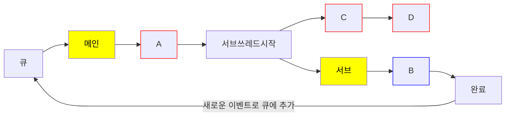

[FEConf Korea SSR 환경(Node.js) 메모리 누수 디버깅 가이드](https://www.youtube.com/watch?v=P3C7fzMqIYg)

---

# 메모리 누수란

- 필요 하지 않은데 메모리가 지속적으로 사용되고 있는 현상

# 메모리 누수가 문제인 이유

- 메모리가 누수되면 다른 어플리케이션을 동작시킬 메모리가 부족하게 됨.
- 누수로 인해 작아진 메모리 용량때문에 GC(Garbage Collection)이 더 자주 동작하게 됨.
이로 인해 CPU의 사용량이 늘어나게 되고 [이벤트 루프](https://www.notion.so/1a0ee035a51f80a9b8dae83a65e334cc?pvs=21)가 블로킹되서 연산이 느려짐.

<aside>
❓

**이벤트 루프란?**

이벤트 루프(Event Loop)는 **이벤트(작업)들을 순서대로 처리하는 반복 실행 구조**.

이벤트 루프가 직접 멀티스레드를 만드는 게 아니라, 시스템(운영체제, 런타임)이 지원하는 스레드를 활용하는 것.

### **어떻게 동작하나?**

1. **이벤트 큐(Event Queue)에 작업(A, B, C...)이 쌓인다.**
2. **이벤트 루프가 큐에서 하나씩 꺼내 실행한다.**
3. **비동기 작업(B, 네트워크 요청 등)은 완료될 때까지 기다리지 않고 다음 작업(C, D)을 실행한다.**
4. **비동기 작업이 끝나면 새로운 이벤트로 큐에 추가되어 실행된다.**
5. **이 과정이 계속 반복된다.**

---

### **왜 중요한가?**

✅ **비동기 작업을 효율적으로 처리** (예: 네트워크 요청, 파일 I/O)

✅ **싱글 스레드에서도 멈추지 않고 여러 작업을 실행 가능**

✅ **GUI, 서버, 네트워크 프로그래밍 등에서 필수적**

✔️ **쉽게 말해 "할 일 리스트에서 하나씩 실행하는 자동 반복 시스템"**

</aside>

# 이벤트 루프를 해결하는 방법

- 힙메모리(Heap memory)의 크기를 늘려주거나 메모리 누수의 범인을 찾아낸다.

### 힙메모리(Heap memory)

V8의 GC는 **힙(Heap) 메모리를 Young Generation과 Old Generation으로 나눠서 관리**함.

---

- **Young Generation (젊은 세대)**
    - 새로운 객체가 생성되는 공간.
    - `nursery`(초기 객체) → `intermediate`(살아남은 객체) 순으로 이동.
    - 대부분의 객체는 여기서 빠르게 할당되고 해제됨.
- **Old Generation (오래된 세대)**
    - Young Generation에서 살아남은 객체가 이동하는 공간.
    - **오래 유지되는 객체(장기 객체)는 여기 저장됨.**
    - 더 큰 메모리를 차지하고, GC 비용이 큼.

---

### **GC(가비지 컬렉션) 유형**

- **Minor GC** (Young Generation에서 실행)
    - Young Generation에서 **사용되지 않는 객체를 빠르게 정리**.
    - `nursery → intermediate → Old Generation` 순으로 객체를 이동시킴.
    - 속도가 빠르고, 애플리케이션에 미치는 영향이 적음.
- **Major GC** (Old Generation에서 실행)
    - Old Generation에서 **더 이상 사용되지 않는 객체를 제거**.
    - **비용이 크고 실행 속도가 느림**, 이벤트 루프를 블로킹할 가능성이 있음.

